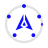

# GenLayer Spinner — Optimistic Democracy

Original animated loading spinner for the **GenLayer Portal**.

## Concept

Five validator nodes (the starting set in Optimistic Democracy) sit around the official **Strong Mark**. A smooth consensus arc travels the ring using a Material-style dash animation while each node pulses in sequence.

- Strong Mark stays **completely static** (official brand rule)
- Colors: Kinetic Cobalt `#110FFF` + official pink→purple→blue gradient
- Pure SVG + CSS (no JavaScript required for the animation)
- Works on light and dark backgrounds
- Readable from 16 px to 96 px+
- Respects `prefers-reduced-motion`

## Why this design is strong for the contest

| Requirement | How we meet it |
|-------------|----------------|
| Original | 5-node Optimistic Democracy concept — not a generic spinner |
| GenLayer identity | Official Strong Mark + official colors + protocol metaphor |
| Smooth infinite loop | Dual animation: rotate + stretching dash |
| Light & dark | Subtle track + theme classes |
| Small sizes | Clean geometry, tested from 16 px |
| Web-ready | SVG + CSS, zero dependencies |

## Files

```
genlayer-spinner/
├── index.html              # Interactive demo
├── README.md
├── css/
│   ├── spinner.css         # Production stylesheet
│   └── demo.css
└── assets/
    ├── spinner.svg         # Self-contained animated SVG
    └── genlayer-mark.svg
```

## Usage (recommended accessible pattern)

```html
<link rel="stylesheet" href="css/spinner.css" />

<!-- Visual spinner (decorative) -->
<div class="gl-spinner gl-spinner--md gl-spinner--brand" aria-hidden="true">
  <!-- paste SVG from assets/spinner.svg or use the template -->
</div>

<!-- Live region for screen readers -->
<div id="gl-spinner-status" class="sr-only" aria-live="polite" role="status"></div>
```

```js
// When loading starts
document.getElementById('gl-spinner-status').textContent = 'Loading…';

// When loading ends
document.getElementById('gl-spinner-status').textContent = '';
```

### Size classes
`--xs` (16) · `--sm` (24) · `--md` (32) · `--lg` (48) · `--xl` (64) · `--2xl` (96)

### Theme classes
`--brand` · `--on-dark` · `--on-light` · `--muted`

### Standalone SVG
```html

```

## Brand compliance

- Official Strong Mark geometry (never recreated as text or rotated)
- Official tokens only: `#110FFF`, `#E37DF7`, `#9B6AF6`
- Calm continuous motion (1.4–1.6 s) — no bounce or spring
- Accessibility pattern included

## License

Community contribution for the GenLayer Portal spinner mission.  
Free to use and ship inside GenLayer products.
